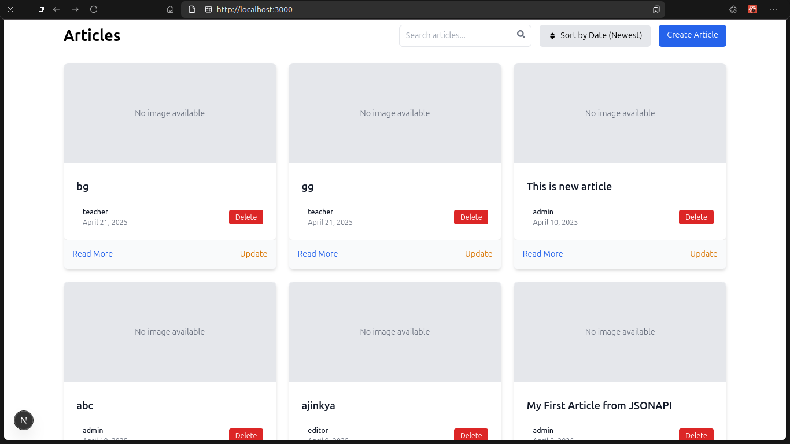
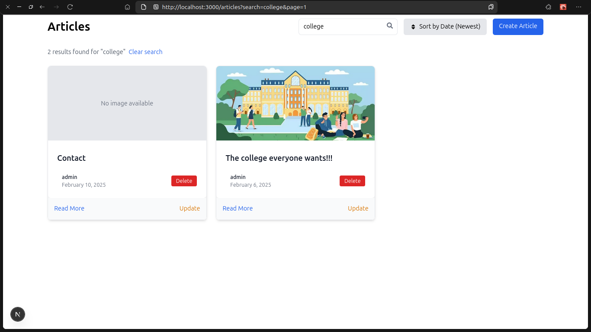
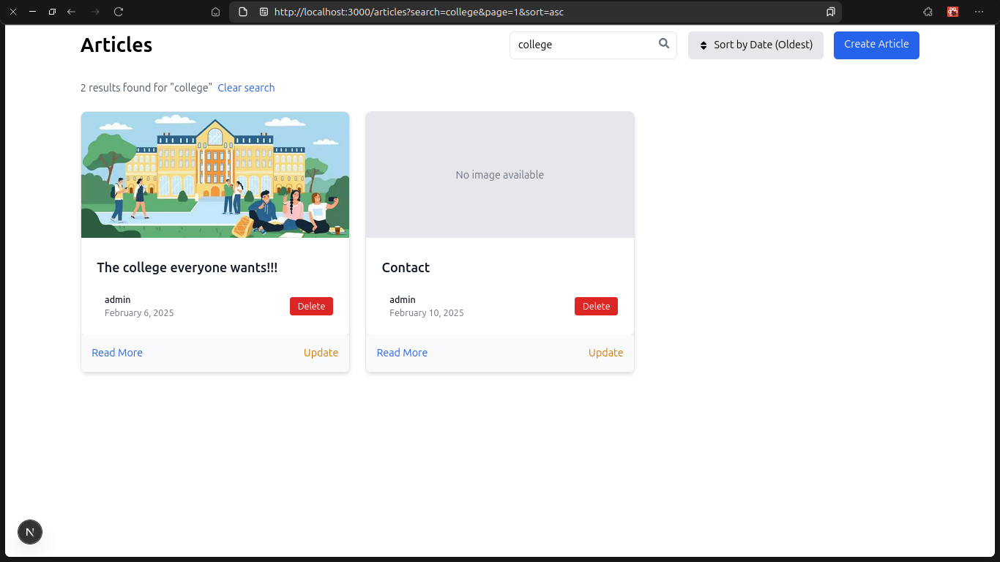
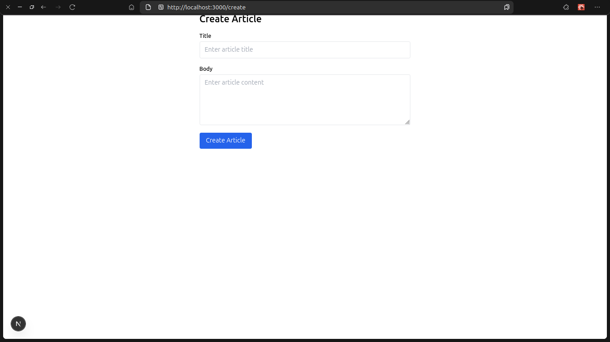
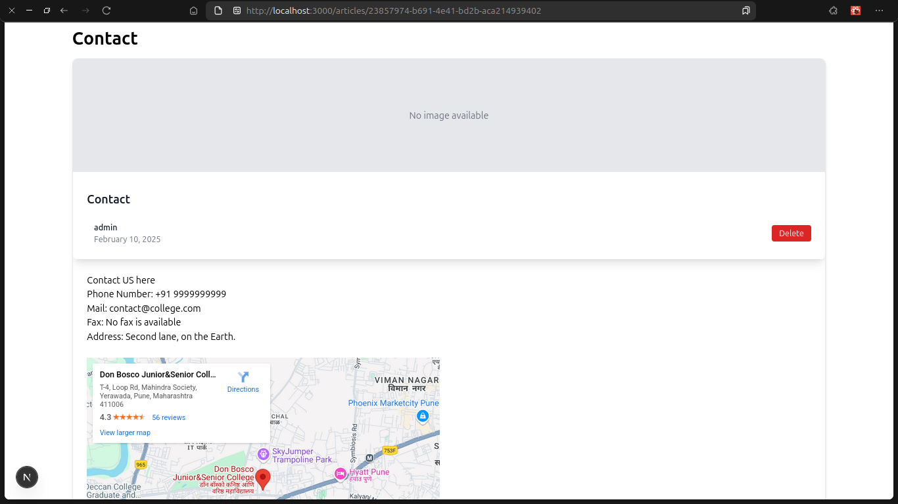
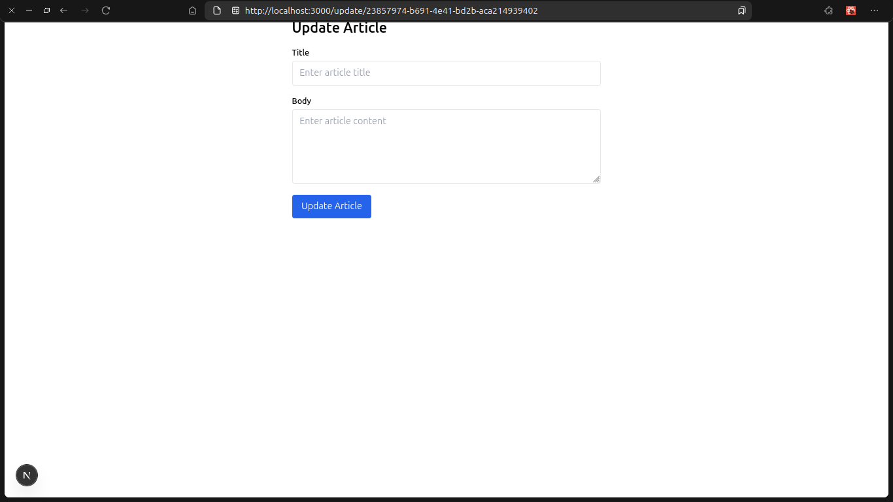
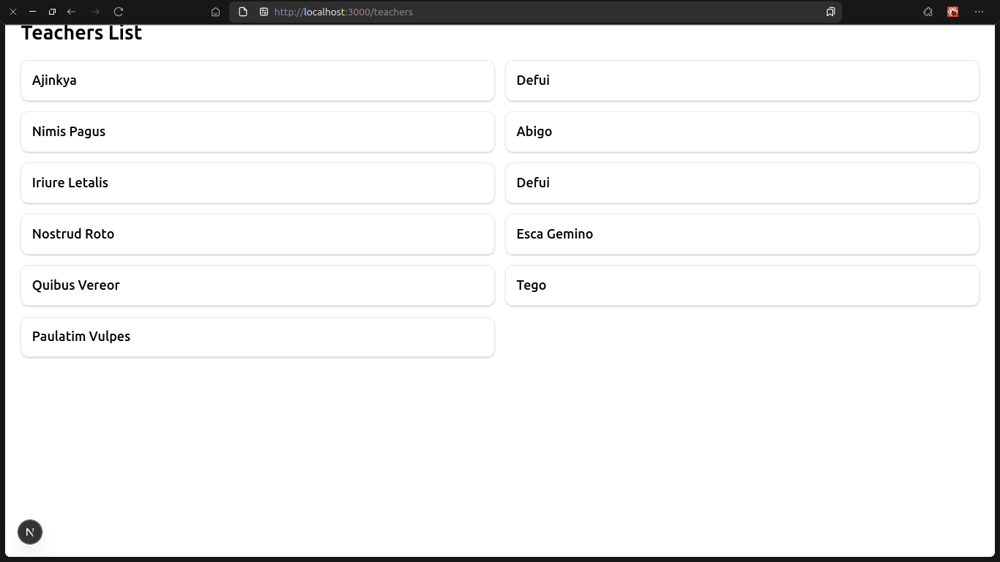

# Next.js + Drupal Project

This project is a Next.js application that integrates with Drupal as a headless CMS. It includes CRUD operations for articles, search functionality, sorting, filtering, pagination, and view loading for teachers list.

## Features

- **Article Management**: Full CRUD operations for article content
- **Search Functionality**: Search articles by title and body
- **Filters & Sorting**: Advanced filtering and sorting options
- **Pagination**: Efficient data loading with pagination
- **Teachers List**: Dedicated view for displaying teacher information

## Installation

1. Clone the repository:
    ```bash
    git clone https://github.com/sapatevaibhav/next
    cd next
    ```

2. Install dependencies:
    ```bash
    npm install
    ```

3. Create a `.env.local` file in the root directory with the following variables:
    ```
    NEXT_PUBLIC_DRUPAL_BASE_URL=your-drupal-url
    NEXT_IMAGE_DOMAIN=your-drupal-domain
    DRUPAL_CLIENT_ID=your-oauth-client-id
    DRUPAL_CLIENT_SECRET=your-oauth-client-secret
    ```

## Running the Project

### Development Mode

```bash
npm run dev
```

Visit `http://localhost:3000` to see the application.

### Production Build

```bash
npm run build
npm start
```

## Routes

- `/` - Homepage
- `/articles` - List of all articles with search, filter, and pagination
- `/articles/[id]` - Individual article view
- `/create` - Create new article (requires authentication)
- `/update/[id]` - Edit existing article (requires authentication)
- `/teachers` - List of all teachers (View from drupal server)


## Results








